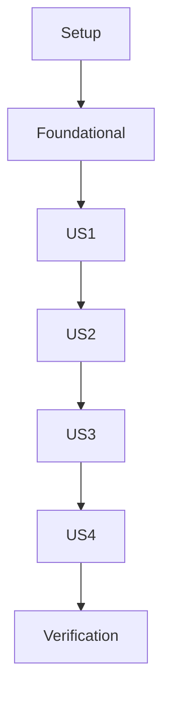

# Tasks: CRM Database Foundations

**Feature Branch**: `050-crm-db-foundations`  
**Goal**: Build the foundational Database configuration and SQLAlchemy ORM models.

## Phase 1: Setup

- [X] T001 [P] Install dependencies `fastapi`, `sqlalchemy`, `asyncpg`, `pydantic-settings`, `pgvector` using `uv` in `backend/`
- [X] T002 [P] Create local `.env` file with PostgreSQL credentials in `backend/`
- [X] T003 Implement Pydantic `Settings` to load database URI in `backend/app/core/config.py`

## Phase 2: Foundational

- [X] T004 Setup SQLAlchemy `AsyncEngine` and `async_sessionmaker` in `backend/app/db/database.py`
- [X] T005 Create SQLAlchemy `DeclarativeBase` in `backend/app/db/models.py`
- [X] T005a Execute `CREATE EXTENSION IF NOT EXISTS vector` in database initialization logic or migration in `backend/`

## Phase 3: [US1] Multi-Channel Customer Identification (Priority: P1)

**Story Goal**: Uniquely identify customers via email or phone number.  
**Independent Test**: Create a customer with only email, then one with only phone, then verify both exist and a third without either fails.

- [X] T006 [US1] Implement `Customer` ORM model with UUID PK and soft-delete fields in `backend/app/db/models.py`
- [X] T007 [US1] Add `CheckConstraint` for "email IS NOT NULL OR phone IS NOT NULL" to `Customer` in `backend/app/db/models.py`

## Phase 4: [US2] Ticket Lifecycle Management (Priority: P1)

**Story Goal**: Track support requests through defined statuses and priorities.  
**Independent Test**: Create a ticket linked to a customer and update its status/priority.

- [X] T008 [US2] Implement `Ticket` ORM model with status/priority/channel enums and `metadata` JSONB in `backend/app/db/models.py`
- [X] T009 [US2] Define One-to-Many relationship between `Customer` and `Ticket` with `RESTRICT` delete behavior in `backend/app/db/models.py`

## Phase 5: [US3] Unified Message History (Priority: P2)

**Story Goal**: Maintain a chronological log of all interactions per ticket with sentiment analysis support.  
**Independent Test**: Log messages with different sender types and retrieve them in chronological order.

- [X] T010 [US3] Implement `Message` ORM model with `agent_id`, `sentiment_score`, and `metadata` JSONB in `backend/app/db/models.py`
- [X] T011 [US3] Define One-to-Many relationship between `Ticket` and `Message` in `backend/app/db/models.py`
- [X] T011a [US3] Implement `OutboxEvent` ORM model for Kafka event atomicity in `backend/app/db/models.py`
- [X] T012 [US3] Add composite indexes for `Message(ticket_id, created_at DESC)` and `Ticket(customer_id, created_at DESC)` in `backend/app/db/models.py`

## Phase 6: [US4] Knowledge Base for AI Agents (Priority: P2)

**Story Goal**: Enable semantic search for AI agents via vector embeddings.  
**Independent Test**: Store a knowledge article with a 1536-dimensional vector and retrieve it.

- [X] T013 [US4] Implement `KnowledgeArticle` ORM model with `pgvector` embedding and `embedding_model` string in `backend/app/db/models.py`

## Phase 7: Verification & Polish

- [X] T014 [P] Create integration tests in `backend/tests/test_db.py` including relationship validation and connection pool health-check resilience
- [X] T015 Create a temporary script to run `create_all()` and verify table existence in `backend/`
- [X] T016 [P] Implement async CRUD helpers (Create/Get) for core entities in `backend/app/db/crud.py`

## Dependency Graph

## Parallel Execution Examples

- **Parallel 1**: T001, T002 (Setup tasks in different files/systems)
- **Parallel 2**: T006, T007 (Internal model logic)

## Implementation Strategy

1. **MVP First**: Focus on completing US1 and US2 as they are P1 priorities and form the core CRM identification logic.
2. **Incremental Delivery**: Deliver US3 (History) and US4 (KnowledgeBase) as subsequent P2 enhancements.
3. **Verification-Driven**: Use T015 early (Phase 3) to verify schema generation as models are added.
